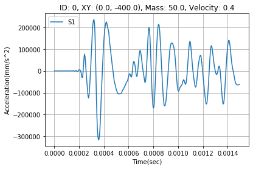
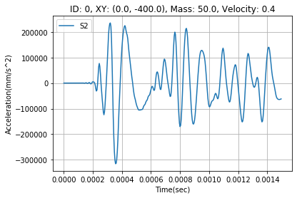
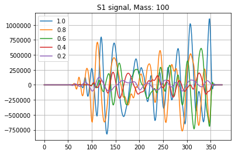
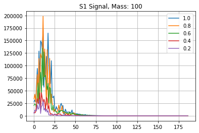
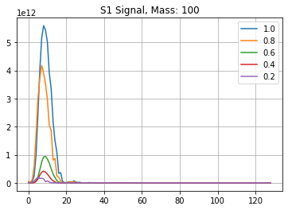
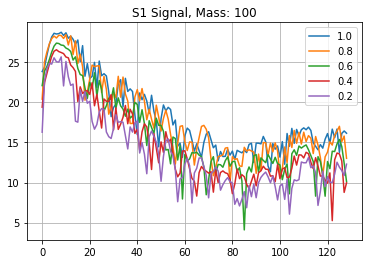
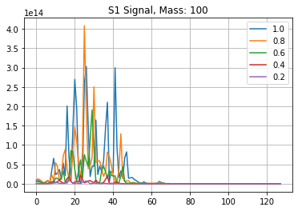

# collider prediction using acceleration sensor
[Collider detection using acceleration sensor](https://dacon.io/competitions/official/235614/overview/) task was to predict collider 2D position(x, y), mass and velocity. 

## Summary of approach
- LB Score: **Ranked 15th (Public 0.0063, Private: 0.00662)**

## Data
- Data visualization 
 
 
 
 

## Feature engineering
- Distance Feature using signal arrival time delta
- Original Signal 
 
- Fast Fourier Transform (FFT) 
 
- Power density estimation (PSD) 
 
- Auto correlation 
 
- Spectrogram 
 
- Mel spectrogram (except) 
 
- Statistical information
- Peak distance mean/std

#### Model & Method
- Residual CNN for time-series
- Multi-layer perceptron
- Permutation feature selection
